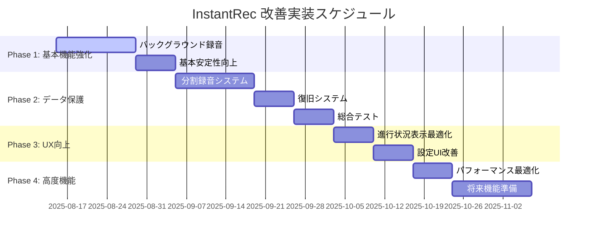

# 🗺️ InstantRec 改善実装ロードマップ

## 🎯 総合戦略

**リアルタイム文字起こし削除後の安定化とユーザー価値向上**

## 📊 優先順位マトリックス

| 改善項目 | ユーザー価値 | 技術的重要度 | 実装難易度 | 優先度 |
|----------|--------------|--------------|------------|--------|
| **バックグラウンド録音** | 🔴 極高 | 🔴 極高 | 🟡 中 | **🥇 最優先** |
| **クラッシュ耐性向上** | 🔴 高 | 🔴 高 | 🔴 高 | **🥈 高優先** |
| **進行状況表示最適化** | 🟡 中 | 🟢 低 | 🟢 低 | **🥉 中優先** |
| **設定UI改善** | 🟡 中 | 🟢 低 | 🟢 低 | **4位 低優先** |

## 🚀 Phase 1: 基本録音機能強化（最優先 - 2-3週間）

### **1.1 バックグラウンド録音対応**
**期限**: 1-2週間  
**担当**: 録音システム全般  

#### **Week 1: 基盤実装**
```swift
// Day 1-2: Info.plist + AVAudioSession設定
- UIBackgroundModes追加
- AVAudioSession.Category.record設定
- バックグラウンドタスク管理

// Day 3-4: AudioService拡張
- BackgroundAudioService実装
- 割り込み処理（電話着信等）
- アプリライフサイクル対応

// Day 5-7: テスト・デバッグ
- 各種シナリオテスト
- バッテリー消費測定
- メモリ使用量最適化
```

#### **Week 2: UI・UX向上**
```swift
// Day 8-10: UI対応
- バックグラウンド状態表示
- 録音継続通知
- ユーザーガイド作成

// Day 11-14: 総合テスト
- 長時間録音テスト（1-2時間）
- 割り込みシナリオテスト
- パフォーマンス最適化
```

**成功基準**:
- ✅ アプリがバックグラウンドでも録音継続
- ✅ 電話着信時の自動復帰
- ✅ 2時間以上の連続録音可能

### **1.2 基本安定性向上**
**期限**: 1週間  
**担当**: エラーハンドリング強化  

#### **Week 3: 予防システム**
```swift
// Day 15-17: システム監視
- メモリ使用量監視
- ディスク容量確認
- バッテリー残量警告

// Day 18-21: エラー処理強化
- 録音失敗時の自動リトライ
- ファイル保存エラー対策
- ユーザー向けエラーメッセージ改善
```

## 🛡️ Phase 2: データ保護システム（高優先 - 3-4週間）

### **2.1 クラッシュ耐性実装**
**期限**: 3週間  
**担当**: データ永続化システム  

#### **Week 4-5: 分割録音システム**
```swift
// Week 4: 分割保存メカニズム
- SegmentedAudioRecorder実装
- 1分毎の自動分割保存
- セグメント統合機能

// Week 5: 状態管理システム
- RecordingStateManager実装
- 10秒間隔での状態保存
- メタデータ永続化
```

#### **Week 6: 復旧システム**
```swift
// Week 6: Recovery機能
- 起動時復旧データ検出
- 復旧UI実装
- 音声ファイル統合処理
```

#### **Week 7: テスト・最適化**
```swift
// Week 7: 総合テスト
- クラッシュシミュレーション
- バッテリー切れテスト
- 復旧精度検証
```

**成功基準**:
- ✅ クラッシュ時90%以上のデータ保護
- ✅ 自動復旧機能動作
- ✅ 1分以内の最大データロス

## 🎨 Phase 3: UX向上（中優先 - 1-2週間）

### **3.1 進行状況表示最適化**
**期限**: 1週間  
**担当**: UI/UX改善  

#### **Week 8: 軽量進行表示**
```swift
// Day 50-54: プログレス表示
- 経過時間の視覚的表示
- 音声レベルメーター改善
- シンプルなステータス表示

// Day 55-56: アニメーション最適化
- 録音中の視覚的フィードバック
- バッテリー効率重視のアニメーション
```

### **3.2 設定UI改善**
**期限**: 1週間  
**担当**: 設定画面強化  

#### **Week 9: 設定機能拡張**
```swift
// Day 57-63: 新規設定項目
- バックグラウンド録音ON/OFF
- 分割保存間隔設定
- 自動復旧設定
- 詳細ログ出力設定
```

## 📈 Phase 4: 高度機能（低優先 - 2-3週間）

### **4.1 パフォーマンス最適化**
**期限**: 1週間  

```swift
// Week 10: 効率化
- メモリ使用量最適化
- バッテリー消費削減
- ファイルI/O効率化
```

### **4.2 将来機能準備**
**期限**: 2週間  

```swift
// Week 11-12: 拡張性向上
- プラグインアーキテクチャ準備
- 外部連携API設計
- 設定データ移行機能
```

## 📅 詳細スケジュール



## 🎯 各Phase成果物

### **Phase 1完了時**:
- ✅ バックグラウンド録音対応完了
- ✅ 長時間録音の安定性確保
- ✅ 基本的なエラー処理強化

### **Phase 2完了時**:
- ✅ クラッシュ耐性システム完成
- ✅ 自動復旧機能実装
- ✅ データロス最小化

### **Phase 3完了時**:
- ✅ 直感的なUX実現
- ✅ 設定の柔軟性向上
- ✅ 視覚的フィードバック改善

### **Phase 4完了時**:
- ✅ 最適化されたパフォーマンス
- ✅ 将来拡張の基盤完成
- ✅ プロダクション準備完了

## 🔍 品質保証計画

### **各Phase共通テスト**:
1. **単体テスト**: 新機能の基本動作確認
2. **統合テスト**: 既存機能との相互作用確認
3. **性能テスト**: メモリ・バッテリー・ストレージ影響測定
4. **ユーザビリティテスト**: 実際の使用シナリオ検証

### **リリース判定基準**:
- ✅ 全機能の基本動作確認
- ✅ 2時間連続録音テスト通過
- ✅ クラッシュ耐性90%以上
- ✅ バッテリー消費が標準範囲内

## 🚀 次のアクションアイテム

### **immediate actions（即座実行）**:
1. **Info.plistバックグラウンドモード追加**
2. **AVAudioSessionカテゴリ変更**
3. **基本的なバックグラウンドテスト実行**

### **Week 1優先タスク**:
1. BackgroundAudioService実装開始
2. アプリライフサイクル管理
3. 割り込み処理実装

---

**🎯 この実装により、InstantRecは信頼性の高い長時間録音アプリとして大幅に改善されます。**