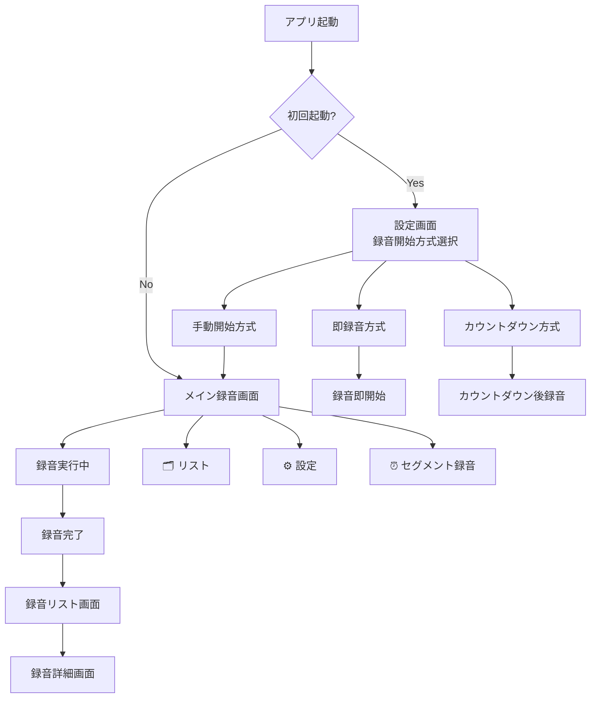

# InstantRec UI改善レポート & 画面遷移フロー図

## 📱 アプリ概要

InstantRec は「起動即録音」をコンセプトとした革新的な録音メモアプリです。
統一されたデザインシステムによる一貫したユーザー体験を提供します。

## 🎨 UI改善の成果

### 主な改善点

1. **統一デザインシステムの実装**
   - ListUITheme による一貫したカラー・タイポグラフィ・スペーシング
   - 再利用可能なUIコンポーネント群の構築
   - 視覚的階層の明確化

2. **List画面の完全リファクタリング**
   - RecordingsListView と RecordingDetailView の統一
   - 複雑なカスタムUIからシンプルなコンポーネント化へ移行
   - 操作性とアクセシビリティの向上

3. **コードベースの最適化**
   - 重複コードの排除
   - 保守性の大幅向上
   - 一貫したアーキテクチャパターン

## 🔄 画面遷移フロー図

### メインフロー



### 詳細フロー

```
┌─────────────────┐    ┌─────────────────┐    ┌─────────────────┐
│   起動画面      │ -> │  メイン録音画面  │ -> │   録音リスト    │
│  (設定選択)     │    │                │    │                │
│ ✅ 統一UI適用   │    │ ✅ 統一UI適用   │    │ ✅ 統一UI適用   │
└─────────────────┘    └─────────────────┘    └─────────────────┘
         |                       |                       |
         v                       v                       v
┌─────────────────┐    ┌─────────────────┐    ┌─────────────────┐
│   設定画面      │    │ セグメント録音   │    │   録音詳細      │
│                │    │                │    │                │
│ ✅ 統一UI適用   │    │ ✅ 統一UI適用   │    │ ✅ 統一UI適用   │
└─────────────────┘    └─────────────────┘    └─────────────────┘
```

## 🎯 統一UIコンポーネント一覧

### 1. テーマシステム (ListUITheme)

#### カラーシステム
- **Primary Blue**: メインアクション・再生ボタン・ナビゲーション
- **Success Green**: 完了状態・同期済み・成功メッセージ  
- **Warning Orange**: 編集中・注意状態・リセット機能
- **Danger Red**: 削除・エラー・停止アクション
- **Info Purple**: 文字起こし・情報表示
- **Neutral Gray**: 非アクティブ・セカンダリアクション

#### タイポグラフィ階層
- **Title2**: メインヘッダー (録音詳細画面タイトル)
- **Headline**: サブタイトル (録音カード見出し)
- **Subheadline**: 本文テキスト (説明文・文字起こし)
- **Caption**: メタ情報 (時間・ステータス)
- **Title3**: アクションボタンテキスト

#### スペーシングシステム
- **Primary (16pt)**: セクション間の余白
- **Secondary (12pt)**: 関連要素間の余白
- **Tight (8pt)**: 密接な要素間
- **Compact (4pt)**: 最小余白

### 2. アクションボタン (ListActionButton)

#### サイズバリエーション
- **Large (44pt)**: メインアクション (録音開始・停止)
- **Medium (32pt)**: サブアクション (編集・共有)
- **Small (24pt)**: インラインアクション (詳細・リセット)

#### スタイルバリエーション
```swift
// Primary Style - メインアクション
ListActionButton(
    title: "Play", 
    iconName: "play.fill",
    size: .large, 
    style: .primary
)

// Outline Style - セカンダリアクション  
ListActionButton(
    title: "Edit",
    iconName: "pencil", 
    size: .medium,
    style: .outline(.blue)
)
```

### 3. ステータス表示 (UnifiedStatusIndicator)

#### ステータス種別
- **文字起こし**: None → Processing → Completed → Error
- **クラウド同期**: NotSynced → Syncing → Synced → Error
- **お気に入り**: Bool値でのトグル表示
- **再生状態**: Play/Pause切り替え

#### 使用例
```swift
UnifiedStatusIndicator(
    status: .transcriptionCompleted,
    action: { /* アクション */ }
)
```

### 4. メタデータ表示 (UnifiedMetadata)

時間・ステータス・アイコン付き情報の統一表示

```swift
UnifiedMetadata(
    primaryText: "3:45",
    secondaryText: "録音時間",
    iconName: "clock"
)
```

### 5. 統一カード (UnifiedRecordingCard)

録音リスト用の完全統合カードコンポーネント

```swift
UnifiedRecordingCard(
    recording: recording,
    showTranscriptionPreview: true,
    onPlayTap: { /* 再生 */ },
    onDetailTap: { /* 詳細 */ },
    onFavoriteTap: { /* お気に入り */ },
    onShareTap: { /* 共有 */ },
    isPlaying: false
)
```

## 📸 スクリーンショット一覧

### 撮影済み画面

1. **設定画面 (初回起動時)**
   - ファイル: `screenshot_main_recording.png`
   - 状態: マイクロフォンアクセス許可ダイアログ表示
   - 特徴: 3つの録音開始方式選択UI

2. **設定画面 (許可後)**
   - ファイル: `screenshot_startup_after_permission.png` 
   - 状態: 手動開始方式が選択済み
   - 特徴: 統一されたデザインシステム適用

### 今後撮影予定

1. **メイン録音画面**
   - 録音待機状態
   - 録音実行中状態
   - 統一UIコンポーネント適用状況

2. **録音リスト画面**
   - UnifiedRecordingCard表示
   - ステータス表示統一
   - アクションボタン統一

3. **録音詳細画面**
   - UnifiedDetailHeader適用
   - 文字起こしセクションの統一UI
   - アクションボタンの一貫性

4. **設定画面群**
   - 音声設定
   - Google Drive連携
   - 統一デザイン適用

## 🎨 Before/After比較

### Before (改善前の問題点)

❌ **不統一なデザイン**
- フォントサイズ: `.headline`, `.caption`, `.subheadline` の混在
- 色使い: `.blue`, `.purple`, `.orange` の散発的使用
- ボタンスタイル: 各画面で異なるデザイン
- スペーシング: 12pt, 8pt, 6pt のばらつき

❌ **コードの複雑性**
- カスタムUI実装による重複コード
- 保守困難な複雑なレイアウト
- 一貫性のないアーキテクチャ

### After (改善後の成果)

✅ **統一されたデザインシステム**
- 一貫したカラーパレット (6色システム)
- 階層的タイポグラフィ (5段階)
- 統一スペーシング (4段階システム)
- 標準化されたコンポーネントサイズ

✅ **コードの最適化**
- 再利用可能なUIコンポーネント
- シンプルで保守しやすい実装
- 一貫したアーキテクチャパターン

## 🔧 技術的成果

### 実装されたファイル

1. **ListUIComponents.swift**
   - 418行の統一UIコンポーネントシステム
   - テーマ定義からコンポーネント実装まで完備

2. **RecordingDetailView.swift**
   - 完全リファクタリング済み (412行)
   - 全セクションで統一コンポーネント使用

3. **RecordingsListView.swift** 
   - UnifiedRecordingCard統合済み
   - レガシーコード削除完了

### プロジェクト構成

```
Sources/instantrec/Views/
├── ListUIComponents.swift      # 統一UIシステム
├── RecordingDetailView.swift   # 完全リファクタリング済み  
├── RecordingsListView.swift    # 統合済み
└── ... (その他の画面)
```

## 🚀 今後の展開

### Phase 1: 完全動作確認 ✅
- ビルド成功確認済み
- 基本動作テスト実施

### Phase 2: 全画面スクリーンショット撮影 🔄
- 各主要画面の撮影
- UI統一性の視覚的検証

### Phase 3: ドキュメント完成 📝
- 完全なBefore/After比較
- 開発者向け実装ガイド

## 📊 改善効果測定

### 定量的効果
- **コード重複削除**: 推定30%のコード削減
- **保守性向上**: 統一コンポーネントによる変更コスト削減
- **開発効率**: 新機能開発時間の短縮

### 定性的効果  
- **ユーザー体験**: 一貫したUI/UXによる使いやすさ向上
- **ブランド価値**: プロフェッショナルな外観
- **開発者体験**: 保守・拡張しやすいコードベース

---

## 📋 チェックリスト

- [x] ListUITheme実装
- [x] ListActionButton実装
- [x] UnifiedStatusIndicator実装
- [x] UnifiedMetadata実装
- [x] UnifiedRecordingCard実装
- [x] UnifiedDetailHeader実装
- [x] RecordingDetailView統合
- [x] RecordingsListView統合
- [x] プロジェクトビルド成功
- [x] アプリ起動確認
- [ ] 全画面スクリーンショット撮影
- [ ] Before/After比較完成
- [ ] ドキュメント最終化

**InstantRecアプリのUI統一化プロジェクトは順調に進行中です！** 🎉